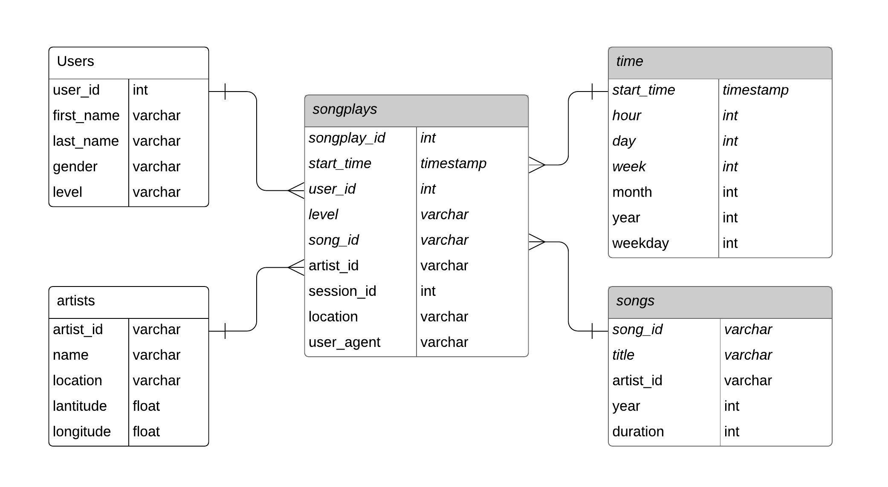

## Introduction
***
A music streaming startup, Sparkify, has grown their user base and song database and want to move their processes and data onto the cloud. Their data resides in S3, in a directory of JSON logs on user activity on the app, as well as a directory with JSON metadata on the songs in their app.

For this subject, a path with building an ETL pipeline that extracts their data from S3, stages them in Redshift, and transforms data into a set of dimensional tables for their analytics team to continue finding insights in what songs their users are listening to, has been designed.

## Project Description
***
There are two datasets that reside in S3. Here are the S3 links for each:

Song data: s3://udacity-dend/song_data
Log data: s3://udacity-dend/log_data

Log data json path: s3://udacity-dend/log_json_path.json

### Data Model
***

Following schema shows data model for Sparkify data. As shown in trhe model, it has one "Fact Table" and four "Dimentional Tables". 
The relation type between dimentional tables and fact table are one to many.

    

    
### Fact Table
1. **songplays** - records in log data associated with song plays i.e. records with page NextSong
    - *songplay_id, start_time, user_id, level, song_id, artist_id, session_id, location, user_agent*

### Dimension Tables
2. **users** - users in the app
    - *user_id, first_name, last_name, gender, level*
3. **songs** - songs in music database
    - *song_id, title, artist_id, year, duration*
4. **artists** - artists in music database
    - *artist_id, name, location, latitude, longitude*
5. **time** - timestamps of records in songplays broken down into specific units
    - *start_time, hour, day, week, month, year, weekday*

### Song Dataset
***
The first dataset is a subset of real data from the Million Song Dataset. Each file is in JSON format and contains metadata about a song and the artist of that song. The files are partitioned by the first three letters of each song's track ID. For example, here are filepaths to two files in this dataset.

song_data/A/B/C/TRABCEI128F424C983.json song_data/A/A/B/TRAABJL12903CDCF1A.json

And below is an example of what a single song file, TRAABJL12903CDCF1A.json, looks like.

{"num_songs": 1, "artist_id": "ARJIE2Y1187B994AB7", "artist_latitude": null, "artist_longitude": null, "artist_location": "", "artist_name": "Line Renaud", "song_id": "SOUPIRU12A6D4FA1E1", "title": "Der Kleine Dompfaff", "duration": 152.92036, "year": 0}

### Log Dataset
***
The second dataset consists of log files in JSON format generated by an event simulator based on the songs in the dataset above. These simulate app activity logs from an imaginary music streaming app based on configuration settings. For example, here are filepaths to two files in this dataset.

log_data/2018/11/2018-11-12-events.json log_data/2018/11/2018-11-13-events.json

Each JSON has the following columns of data:

artist,auth, firstName, gender, itemInSession, lastName, length, level, location, method, page, registration, sessionId, song, status, ts, userAgent, userId

## How to Run

First create and run an `AWS Redshift Cluster` and then in **terminal**, set path to project root and execute following commands.

1. for creating tables: 
>`python create_tables.py`
2. ETL process: 
>`python etl.py`